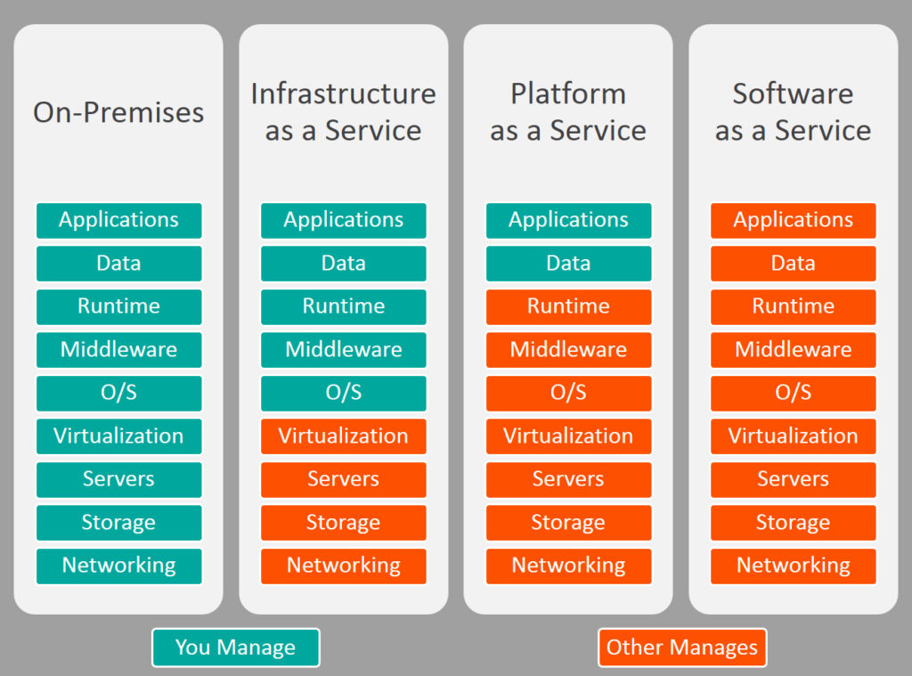
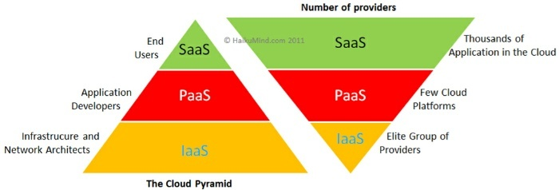

## SaaS, PaaS, IaaS

**Examples**

SaaS - Google Apps, Dropbox, Salesforce, Cisco WebEx, Concur, GoToMeeting
PaaS - AWS Elastic Beanstalk, Windows Azure, Heroku, Force.com, Google App Engine, Apache Stratos, OpenShift
IaaS - DigitalOcean, Linode, Rackspace, Amazon Web Services (AWS), Cisco Metapod, Microsoft Azure, Google Compute Engine (GCE)
